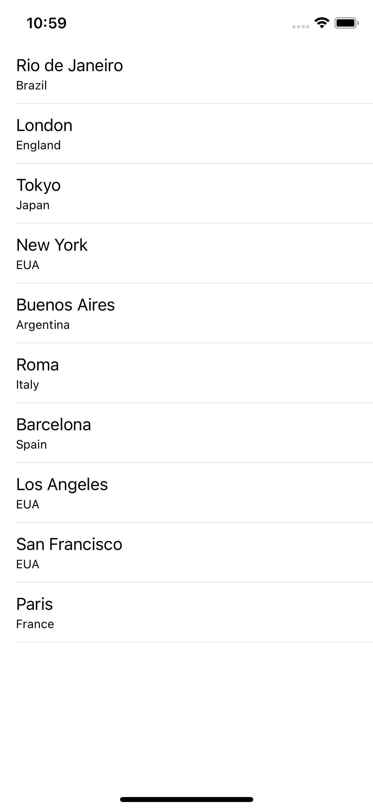
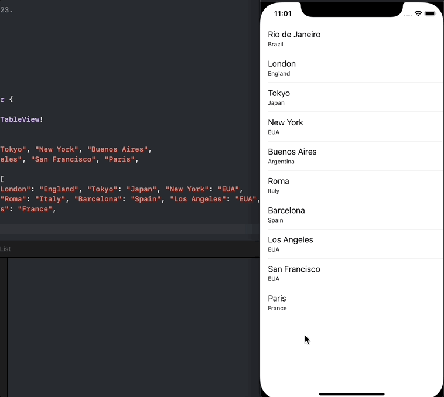

# CityList App

Swift course assignment.

### Requirements

- Should present 10 cities with the respective countries in a UITableView
- The cell text should be the city name and the secondary text the country name
- Should print the city/country when the user tap the cell

### Result

  

